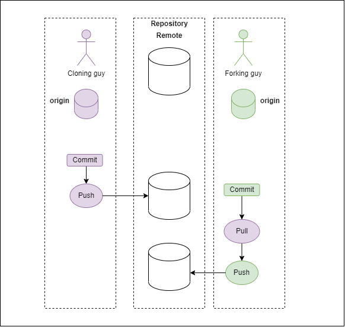

### Git Workshop
Hello 👋
Welcome to Git Workshop. It's a very simple repository containing the basics of Git, some theory, good practices and exercises.
Hope you'll learn something new and enjoy whatever it is that you find here ✨

### What is Git?
Git is a version control system allowing for users to share their work (in most cases - programming) and publish it, a collaboration tool.
Git works uses hashes in a key-value form to save every action taken on the software. Every objects has it's hash value, which Git uses to navigate to whenever a change is made.
The structure resembles a tree 🌳 Additionally, each user has it's own copy of the repository on their local machine (contrary to an SVN system).
Another big difference between git and other version control systems is an access to the local history. In most cases you don't need to change your history of the files, however
it's permitted.
Git generally isn't a good place for storing big files (you can, however use the [git-lfs](https://git-lfs.github.com/))

#### Branches
As mentioned before, git has a tree-like structure 🌳 it operates on branches, which can be merged/rebased/pulled from/pushed into whatever you need.

#### Common Misconceptions
1. You will break the git repository with one push - that's not true. Git is easy to learn, but hard to master. For one push to destroy the whole repository, well... that requires a lot of skill.
2. You only commit when the feature is production-ready - think of commits as more of 'updates' on the process.
3. Merge/rebasing is scary - unless you're using *force push* then everything will be alright.

#### Basic Commands
1. Add -> stage a change. Never use `git add . `, as you could potentially stage files that are not supposed to be changed or added.
2. Commit -> commit staged changes. Remember to use proper messages to commit!
3. Push -> push commited changes
4. Rebase -> when working as an internal collabolator; moves entire changes to the branchs' HEAD; changes the history!
5. Merge -> similarly to rebase, but doesn't change the history nor any of the existing branches.
6. Checkout -> to switch a branch
7. Status -> see the current status of repository.
8. Stash -> stashes changes for later use
9. Fetch -> saves changes from a remote repository without applying them with checkout/pull
10. Restore -> restores a file from changes made on it.

#### Remote vs Origin
*Remote* is a repository on a server.
*Origin* is your local version, stored on the device.

You can add to remote (if you're workng on forks for isntance) by using `git remote add <name> <url>`.

### Exercises:
1. Fork this repository
  * Make a branch
  * Make some changes
  * Stage your changes 
  * Commit those changes
  * Create a PR
  * Use git merge
  * Push to official repository
2. Clone the repository
  * Make a branch
  * Make some changes
  * Stage your changes 
  * Commit those changes
  * Create a PR
  * Use git rebase
  * Push to official repository
